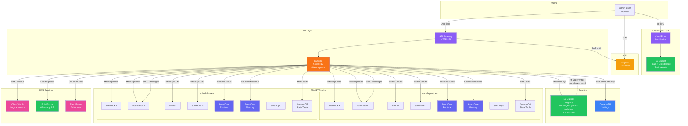

```mermaid
graph TB
    subgraph Users
        Admin[Admin User<br/>Browser]
    end

    subgraph CloudFront + S3
        CF[CloudFront<br/>Distribution]
        S3F[S3 Bucket<br/>React + Cloudscape<br/>Static Assets]
    end

    subgraph Auth
        Cognito[Cognito<br/>User Pool]
    end

    subgraph API Layer
        APIGW[API Gateway<br/>HTTP API]
        Lambda[Lambda<br/>handler.py<br/>40+ endpoints]
    end

    subgraph Registry
        S3R[S3 Bucket<br/>Registry<br/>socialagent.yaml + tools.json<br/>+ skills/*.md]
        DDB[DynamoDB<br/>Settings]
    end

    subgraph SMART Stacks
        subgraph socialagent-dev
            WH1[Webhook λ]
            NT1[Notification λ]
            EV1[Event λ]
            SC1[Scheduler λ]
            RT1[AgentCore<br/>Runtime]
            MEM1[AgentCore<br/>Memory]
            SNS1[SNS Topic]
            ST1[DynamoDB<br/>State Table]
        end
        subgraph scheduler-dev
            WH2[Webhook λ]
            NT2[Notification λ]
            EV2[Event λ]
            SC2[Scheduler λ]
            RT2[AgentCore<br/>Runtime]
            MEM2[AgentCore<br/>Memory]
            SNS2[SNS Topic]
            ST2[DynamoDB<br/>State Table]
        end
    end

    subgraph AWS Services
        CW[CloudWatch<br/>Logs + Metrics]
        EUM[EUM Social<br/>WhatsApp API]
        EB[EventBridge<br/>Scheduler]
    end

    Admin -->|HTTPS| CF
    CF --> S3F
    Admin -->|Auth| Cognito
    Admin -->|API calls| APIGW
    APIGW -->|JWT auth| Cognito
    APIGW --> Lambda

    Lambda -->|Read configs| S3R
    Lambda -->|Read/write settings| DDB
    Lambda -->|Health probes| WH1 & NT1 & EV1 & SC1
    Lambda -->|Health probes| WH2 & NT2 & EV2 & SC2
    Lambda -->|Send messages| NT1 & NT2
    Lambda -->|List conversations| MEM1 & MEM2
    Lambda -->|List templates| EUM
    Lambda -->|Read metrics| CW
    Lambda -->|List schedules| EB
    Lambda -->|Read state| ST1 & ST2
    Lambda -->|Runtime status| RT1 & RT2

    %% Auto-registration flow
    S3R -.->|tf-apply writes<br/>socialagent.yaml| Lambda

    style CF fill:#8B5CF6,color:#fff
    style S3F fill:#22C55E,color:#fff
    style Cognito fill:#F59E0B,color:#fff
    style APIGW fill:#8B5CF6,color:#fff
    style Lambda fill:#F97316,color:#fff
    style S3R fill:#22C55E,color:#fff
    style DDB fill:#3B82F6,color:#fff
    style CW fill:#EC4899,color:#fff
    style EUM fill:#22C55E,color:#fff
    style EB fill:#EC4899,color:#fff
    style RT1 fill:#6366F1,color:#fff
    style RT2 fill:#6366F1,color:#fff
    style MEM1 fill:#6366F1,color:#fff
    style MEM2 fill:#6366F1,color:#fff
```
